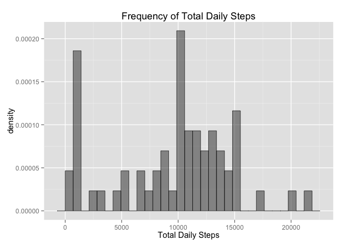
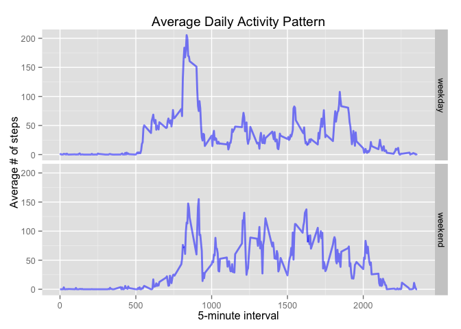

# Reproducible Research:  Peer Assessment 1
`r Sys.Date()`  

## *Loading and preprocessing the data*


```r
## Environment initilization
library(data.table, warn.conflicts = FALSE, quietly = TRUE)
library(dplyr, warn.conflicts = FALSE, quietly = TRUE)
library(ggplot2, warn.conflicts = FALSE, quietly = TRUE)
library(impute, warn.conflicts = FALSE, quietly = TRUE)
setwd("~/Documents/Coursera/JHUDS/module-5/RepData_PeerAssessment1")

unzip("activity.zip")

## Read the data into a data table
chrInput <- "activity.csv"
dtActivity <- as.data.table(read.table(chrInput, header = TRUE, sep = ",",
                                       colClasses = c("integer", "Date", "integer")))
```

## *What is the mean total number of steps taken per day?*


```r
## Summarize data for daily total steps and calculate the mean and median of the set.
dtActTab <- summarize(group_by(dtActivity, date), numDailySteps = sum(steps, na.rm = TRUE))
numActTab1 <- dtActTab[, c(mean(numDailySteps), median(numDailySteps))]


## Plot a histogram of the daily total steps
ggplot(dtActTab, aes(x = numDailySteps)) +
     geom_histogram(alpha = 0.5, size = 0.25, color = "black", aes(y = ..density..)) +
     ggtitle("Frequency of Total Daily Steps") +
     xlab("Total Daily Steps") +
     guides(fill = FALSE)
```

```
## stat_bin: binwidth defaulted to range/30. Use 'binwidth = x' to adjust this.
```

 

The mean number of total steps taken per day is:

```r
round(numActTab1[1])
```

[1] 9354

The median number of total steps taken per day is: 

```r
as.integer(numActTab1[2])
```

[1] 10395


## *What is the average daily activity pattern?*


```r
## Summarize data for interval average steps across all days.  Find interval with maximum average.
dtActTab <- summarize(group_by(dtActivity, interval), numIntervalAvgSteps = mean(steps, na.rm = TRUE))
dtActTab <- dtActTab[, boolMaxAve := {temp <- max(dtActTab$numIntervalAvgSteps);
                                      temp == dtActTab$numIntervalAvgSteps}]
numActTab2 <- dtActTab[dtActTab$boolMaxAve == TRUE,]

## Plot a time series of the 5-minute interval of average steps across all days
ggplot(dtActTab, aes(x = interval, y = numIntervalAvgSteps)) +
     geom_line(alpha = 0.5, size = 1, color = "blue") +
     ggtitle("Average Daily Activity Pattern") +
     xlab("5-minute interval") +
     ylab("Average # of steps")
```

 

The 5-minute interval with the maximum average number of steps during the period is interval:

```r
numActTab2$interval
```

[1] 835

## *Imputing missing values*

The total number of missing values in the dataset is:

```r
nrow(dtActivity[is.na(dtActivity$steps), ])
```

[1] 2304


```r
## Imputing strategy is to use the interval median of all days measured.
dtActTab <- summarize(group_by(dtActivity, interval),
                      numIntervalAvgSteps = median(steps, na.rm = TRUE))
setkey(dtActivity, interval)
setkey(dtActTab, interval)
dtActImpute <- merge(dtActivity, dtActTab)

dtActImpute <- mutate(dtActImpute, steps = ifelse(is.na(dtActImpute$steps),
                                                  dtActImpute$numIntervalAvgSteps,
                                                  dtActImpute$steps))

## Summarize data for daily total steps and calculate the mean and median of the set.
dtActTab <- summarize(group_by(dtActImpute, date), numDailySteps = sum(steps))
numActTab3 <- dtActTab[, c(mean(numDailySteps), median(numDailySteps))]

## Plot a histogram of the daily total steps
ggplot(dtActTab, aes(x = numDailySteps)) +
     geom_histogram(alpha = 0.5, size = 0.25, color = "black", aes(y = ..density..)) +
     ggtitle("Frequency of Total Daily Steps") +
     xlab("Total Daily Steps") +
     guides(fill = FALSE)
```

```
## stat_bin: binwidth defaulted to range/30. Use 'binwidth = x' to adjust this.
```

 

The new mean number of total steps taken per day is: 

```r
round(numActTab3[1])
```

[1] 9504

Compared to the original computed mean, imputing the dataset resulted in a net % change in the mean number of total steps taken per day to be:

```r
round(100 * (numActTab3[1] - numActTab1[1]) / numActTab1[1], digits = 2)
```

[1] 1.6

The new median number of total steps taken per day is:

```r
as.integer(numActTab3[2])
```

[1] 10395

Compared to the original computed median, imputing the dataset resulted in a net % change in the median number of total steps taken per day to be:

```r
round(100 * (numActTab3[2] - numActTab1[2]) / numActTab1[2], digits = 2)
```

[1] 0

## *Are there differences in activity patterns between weekdays and weekends?*


```r
## Mutate imputed dataset to add weekday / weekend factor
dtActImpute <- mutate(dtActImpute,
                      facWeekSeg = factor(1*(weekdays(date) %in% c("Saturday", "Sunday")),
                                          labels = c("weekday", "weekend")))

dtActTab <- summarize(group_by(dtActImpute, interval, facWeekSeg),
                      numIntervalAvgSteps = mean(steps))

## Plot a time series of the 5-minute interval of average steps across all days,
## separating weekday and weekend panels
ggplot(dtActTab, aes(x = interval, y = numIntervalAvgSteps)) +
     geom_line(alpha = 0.5, size = 1, color = "blue") +
     facet_grid(facWeekSeg ~.) +
     ggtitle("Average Daily Activity Pattern") +
     xlab("5-minute interval") +
     ylab("Average # of steps")
```

 
