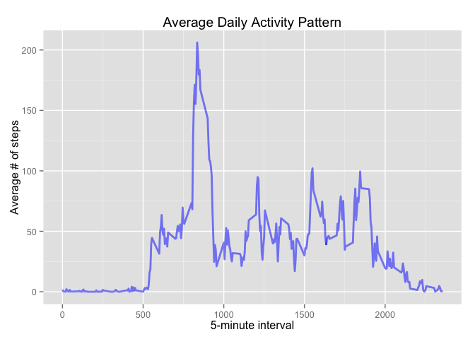

# Reproducible Research:  Peer Assessment 1
15 March 2015  

## *Loading and preprocessing the data*


```r
## Environment initilization
library(data.table, warn.conflicts = FALSE, quietly = TRUE)
library(dplyr, warn.conflicts = FALSE, quietly = TRUE)
library(impute, warn.conflicts = FALSE, quietly = TRUE)
setwd("~/Documents/Coursera/JHUDS/module-5/RepData_PeerAssessment1")

unzip("activity.zip")

## Read the data into a data table
chrInput <- "activity.csv"
dtActivity <- as.data.table(read.table(chrInput, header = TRUE, sep = ",",
                                       colClasses = c("integer", "Date", "integer")))
```

## *What is mean total number of steps taken per day?*


```r
## Summarize data for daily total steps and calculate the mean and median of the set.
dtActTab <- summarize(group_by(dtActivity, date), numDailySteps = sum(steps, na.rm = TRUE))
numActTab1 <- dtActTab[, c(mean(numDailySteps), median(numDailySteps))]


## Plot a histogram of the daily total steps
par(family = "mono")
hist(dtActTab$numDailySteps,
     breaks = ceiling(max(dtActTab$numDailySteps) / 1000),
     main = "Frequency of Total Daily Steps", xlab = "Total Daily Steps")
```

 

The mean number of total steps taken per day is **9354**.

The median number of total steps taken per day is **10395**.


## *What is the average daily activity pattern?*


```r
## Summarize data for interval average steps across all days.  Find interval with maximum average.
dtActTab <- summarize(group_by(dtActivity, interval), numIntervalAvgSteps = mean(steps, na.rm = TRUE))
dtActTab <- dtActTab[, boolMaxAve := {temp <- max(dtActTab$numIntervalAvgSteps);
                                      temp == dtActTab$numIntervalAvgSteps}]
numActTab2 <- dtActTab[dtActTab$boolMaxAve == TRUE,]

par(family = "mono")
with(dtActTab, {
     plot(dtActTab$interval, dtActTab$numIntervalAvgSteps, type = "l",
          main = "Average Daily Activity Pattern",
          xlab = "5-minute interval", ylab = "Average # of steps")
})
```

 

The 5-minute interval with the maximum average number of steps during the period is interval **835**.

## *Imputing missing values*


The total number of missing values in the dataset is **2304**.


```r
## Imputing strategy is to use the interval median of all days measured.
dtActTab <- summarize(group_by(dtActivity, interval),
                      numIntervalAvgSteps = median(steps, na.rm = TRUE))
setkey(dtActivity, interval)
setkey(dtActTab, interval)
dtActImpute <- merge(dtActivity, dtActTab)

dtActImpute <- mutate(dtActImpute, steps = ifelse(is.na(dtActImpute$steps),
                                                  dtActImpute$numIntervalAvgSteps,
                                                  dtActImpute$steps))

## Summarize data for daily total steps and calculate the mean and median of the set.
dtActTab <- summarize(group_by(dtActImpute, date), numDailySteps = sum(steps))
numActTab3 <- dtActTab[, c(mean(numDailySteps), median(numDailySteps))]

## Plot a histogram of the daily total steps
par(family="mono")
hist(dtActTab$numDailySteps,
     breaks=ceiling(max(dtActTab$numDailySteps) / 1000),
     main="Frequency of Total Daily Steps", xlab="Total Daily Steps")
```

 

The new mean number of total steps taken per day is **9504**.  Compared to the original computed mean, imputing the dataset resulted in a net % change in the mean number of total steps taken per day to be **1.6%**

The new median number of total steps taken per day is **10395**.  Compared to the original computed median, imputing the dataset resulted in a net % change in the median number of total steps taken per day to be **0%**

## *Are there differences in activity patterns between weekdays and weekends?*


```r
## Mutate imputed dataset to add weekday / weekend factor
dtActImpute <- mutate(dtActImpute,
                      facWeekSeg = factor(1*(weekdays(date) %in% c("Saturday", "Sunday")),
                                          labels = c("weekday", "weekend")))

dtActTab <- summarize(group_by(dtActImpute, interval, facWeekSeg),
                      numIntervalAvgSteps = mean(steps))

par(family = "mono", mfrow = c(2, 1), mar = c(4, 4, 2, 1), oma = c(1, 1, 1, 1))

with(dtActTab[dtActTab$facWeekSeg=="weekend", ], 
     plot(interval, numIntervalAvgSteps, type = "l", 
          main = "Weekend",
          xaxt="n", xlab = "", ylab = "Average # of steps"))

with(dtActTab[dtActTab$facWeekSeg=="weekday", ], 
     plot(interval, numIntervalAvgSteps, type = "l", 
          main = "Weekday",
          xlab = "5-minute interval", ylab = "Average # of steps"))
```

 
